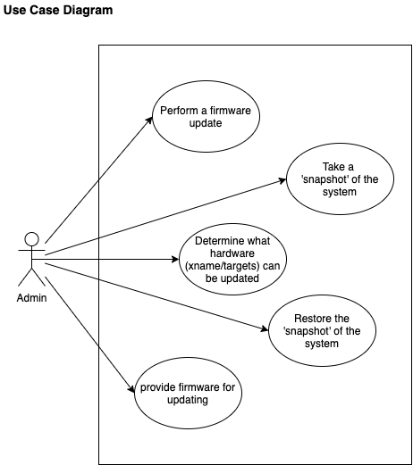
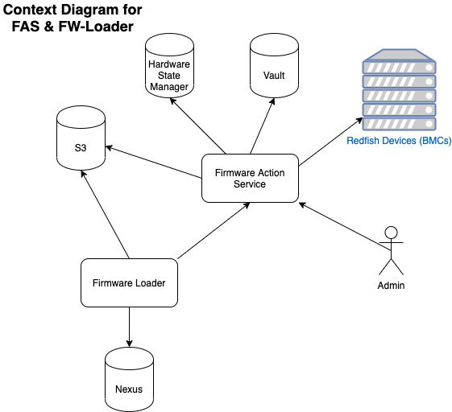
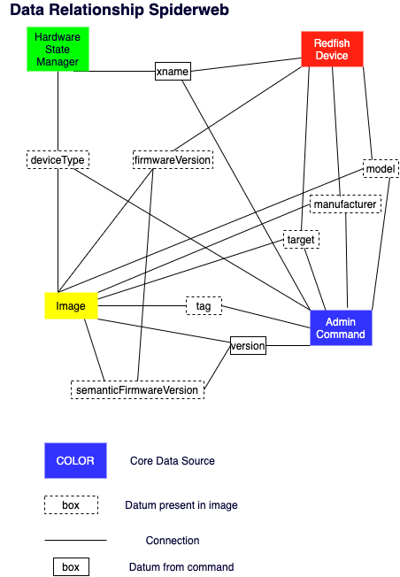

# Firmware Action Service | Architecture Overview

### Definitions <a name="definition"></a>

* ACTION - A collection of operations initiated by user request to update to the firmware images on a set of hardware. Ex) Update the gigabyte BMC targets to latest.

* OPERATION - An update (upgrade/downgrade) to a specific device's Firmware Target. Ex) Update x0c0s1b0 BIOs Target to v1.2.0

* SNAPSHOT - a point in time record of what firmware images were running on the system (a device's targets), constrained by user defined parameters (xname, model/manufacturer, etc).  Used to 'RESTORE' the system part back to specific firmware versions.

## FAS Use Cases

There are several use cases for using the FAS to update firmware on the system. These use cases are intended to be run by system administrators with a good understanding of firmware. Under no circumstances should non- admin users attempt to use FAS or perform a firmware update.



* Perform a firmware update: Update the firmware of an xname's target to the latest, earliest, or an explicit version.
* Determine what hardware can be updated by performing a dry-run: The easiest was to determine what can be updated is to perform a dry-run of the update.
* Take a snapshot of the system: Record the firmware versions present on each target for the identified xnames. If the firmware version corresponds to an image available in the images repository, link the imageID to the record.
* Restore the snapshot of the system: Take the previously recorded snapshot and use the related imageIDs to put the xname/targets back to the firmware version they were at, at the time of the snapshot.
* Provide firmware for updating: FAS can only update an xname/target if it has an image record that is applicable. Most admins will not encounter this use case.

## Key Concepts

### Firmware Actions

An action is collection of operations, which are individual firmware update tasks. Only one FAS action can be run at a time. Any other attempted action will be queued. Additionally, only one operation can be run on an xname at a time. For example, if there are 1000 xnames with 5 targets each to be updated, all 1000 xnames can be updating a target, but only 1 target on each xname will be updated at a time.

The life cycle of any action can be divided into the static and dynamic portions of the life cycle.

The static portion of the life cycle is where the action is created and configured. It begins with a request to create an action through either of the following requests:

* Direct: Request to `/actions` API.
* Indirect: Request to restore a snapshot via the `/snapshots` API.

The dynamic portion of the life cycle is where the action is executed to completion. It begins when the actions is transitioned from the `new` to `configured` state. The action will then be ultimately transitioned to an end state of `aborted` or `completed`.

### Firmware Images

FAS requires images in order to update firmware for any device on the system. An image contains the data that allows FAS to establish a link between an admin command, available devices (xname/targets), and available firmware.

The following is an example of an image:


```json
{ 
 "imageID": "3fa85f64-5717-4562-b3fc-2c963f66afa6",
 "createTime": "2020-05-11T17:11:07.017Z",
 "deviceType": "nodeBMC",
 "manufacturer": "intel", 
 "model": ["s2600","s2600_REV_a"],
 "target": "BIOS",
 "tag": ["recovery", "default"],
 "firmwareVersion": "f1.123.24xz", 
 "semanticFirmwareVersion": "v1.2.252",
 "updateURI": "/redfish/v1/Systems/UpdateService/BIOS", 
 "needManualReboot": true, 
 "waitTimeBeforeManualRebootSeconds": 600,
 "waitTimeAfterRebootSeconds": 180,
 "pollingSpeedSeconds": 30,
 "forceResetType": "ForceRestart",
 "s3URL": "s3://firmware/f1.1123.24.xz.iso",
 "allowableDeviceStates": [ "On", "Off" ]
} 
```

The main components of an image are described below:

- **Unique Identfier Set** : These fields are how admins assess what firmware is on a device, and if an image is applicable to that device. This includes:
  - `deviceType`
  - `manufacturer`
  - `model`
  - `target
  - `tag` 
  - `semanticFirmwareVersion` (firmware version) fields.
- **Process guides** : FAS gets information about how to update the firmware from these fields. These values determine if FAS is responsible for rebooting the device, and what communication pattern to use. This includes:
  - `forceResetType`
  - `pollingSpeedSeconds`
  - `waitTime(s)`
  - `allowableDeviceStates`
- **s3URL** :  The URL that FAS uses to get the firmware binary and the download link that is supplied to Redfish devices. Redfish devices are not able to directly communicate with S3 through its protocol, instead FAS relays an HTTP accessible link to the Redfish device.

## Context Diagram <a name="context"></a>



This is a dual context diagram.  The two systems under consideration are the `Firmware Action Service` and the `Firmware Loader` (aka `FW-loader`). They are separate entities but closely related.

Firmware Action Service

* Hardware State Manager - Source of device information, used to determine which hardware to update or snapshot
* Vault - Source of Credentials needed to communicated with the devices
* s3 - AWS s3; `fw-update` bucket; used to store the firmware binaries and provide a URL to the redfish devices for firmware update.
* Redfish Devices (commonly BMCs, but not exclusively) - Hardware that has firmware targets that need updated.  Also used to determine the firmware version currently running and to determine the manufacturer and model information.
* Admin - Interacts with FAS according to use cases.

Firmware Loader - kubernetes job that downloads and extracts RPMs from Nexus, loads the extracted firmware binaries into s3, and creates image records in FAS.

* Nexus - `shasta-firmware` repository; proxied to DST. Source of firmware RPMs (that contain the firmware binary, and the imagefile json, used to create a firmware record in FAS).
* s3 - AWS s3; `fw-update` bucket; used by FW loader to take the binaries extracted from the RPMs and store them in an accessible location.
* Firmware Update Service - Creates image records in FAS containing necessary meta-data (explained later) and the point to the binaries in s3.


## Data Relationships <a name="relationship"></a>

 

The data relationships describe the connections between data sources.

This spider web of connections helps illustrate the connections between data sources.  An `Admin Command` is the concept that weaves many of these datums together.

We depend on HSM to get:

* xnames
* high level information -> fqdn, device type, etc.
* We then get credentials from Vault

We depend on the Redfish device to get:

* targets
* current firmware versions
* model
* manufacturer

We depend on the lookup from the image to filter:

* device type
* firmware version
* model
* manufacturer
* target

We depend on the admin command to OPTIONALLY filter :

* device type
* tag
* model
* manufacturer
* target
* semantic firmware version


The way we figure out semantic firmware version is:

* Based on admin command find the xname/targets that should be updated.  
* Based on the information from the redfish devices find images that MAY apply to it.
* Based on the images present, look at the semantic versions to find `latest` or `earliest`.

## How FAS works <a name="works"></a>
When FAS receives a command to start an action it will perform the action in three phases:

1. filter -> using the parameters of the action filter hardware and images to a list of viable operations.
2. plan -> once a list of viable operations have been identified setup xname level blocking for operations.  No TWO operations can execute on the same xname at the same time.
3. execute -> once the operations have been planned then begin execution of the operations as fast as possible.

### Filter

The filter phase uses the 5 primary filters:

* command
* stateComponentFilter
* targetFilter
* inventoryHardwareFilter
* imageFilter

to determine what operations to create.  All filters are logically AND'd together.  There is a precedence, but this is only for program efficiency.  

#### Command
The command group is the most important part of an action command; it will control if the action is executed as live update or dryrun and whether or not to override an operation that would normally not be executed because there is no way to return the xname/target to the pervious firmware version (because an image does not exist in the image repository).

#### State Component
The state component filter allows a user to select hardware for updating on a system.  The user can use a very fine grained selection, relying on xnames, or can use partition or group level filtering to select whole swaths of devices.

#### Inventory Hardware
The inventory hardware filter takes place AFTER the state component filter has been applied.  It will remove any devices that do not conform to the identified manufacturer or models as determined by querying the redfish endpoint.  

**NOTE**: it is VERY possible that there can be a mismatch on models.  The model field is human readable, and is human programmable.  In some cases there can be 'typos'; where a hardware tech has programmed a wrong model, or very slightly wrong model, which causes the lookup to filter.  If this occurs the best course of action is to query the hardware, learn what the model is, add it to the images repository on the image desired.

#### Image
FAS exists to apply an image to xname/targets.  The image filter is a way to specify an explicit image that should be used.  When included with other filters it would reduce the devices considered to only those devices where the image could possibly be applied.   ex: user specifies an image that only applies to gigabyte, nodeBMCs, BIOS target.  User also specifies to use ALL hardware in the system (an empty stateComponentFilter).  In this case FAS would find all devices in the system that could be firmware updated via Redfish, then the image filter would remove all xname/targets that this image could not be applied.  E.g. FAS would remove any device that is not a gigabyte nodeBMC.  It would further remove any target that is not BIOS.

#### Target
A Redfish device has potentially many targets (also called members).  Examples include, but are not limited to:

* BIOS
* BMC
* NIC
* Node1.Bios
* Node0.Bios
* Recovery

The target filter removes 'targets' from the candidate list, when they do not match the targets. e.g. if the user specifies only the BIOS target, FAS would remove any candidate operation that was not explicitly for BIOS.


### Plan
After a list of candidate operations have been created the action will be planned.  During the planning phase the following tasks will be completed:

* Determine if any operations are `noSolution` -> meaning there is NO viable image to apply
* Determine if any operations are `noOperation` -> meaning there is NO NEED to apply an update as the desired version is already present on the xname/target
* block sibling operations -> only one operation can be executed per xname at a time. If there are multiple operations per xname, allow only one of them to start.

### Execute
After all the action has been `configured` begin the action.  Only one action may execute at a time. These are executed first-come-first-serve.  Once the blocking action is complete execute the action. This will take all operations from `configured` to a final state of `failed` `succeeded` `aborted`.


 <a href="#top">Back to top</a>

## How fw-loader works <a name="fw-loader"></a>

Process:

1. The fw-loader pulls firmware bundled (currently RPMs) from Nexus.  The firmware is in `shasta-firmware` on the system.
2. the loader extracts the RPM and gets the json (imagefile).
3. the loader uploads the binaries into S3;  then takes the json files to load the data in FAS, using the s3 reference.


