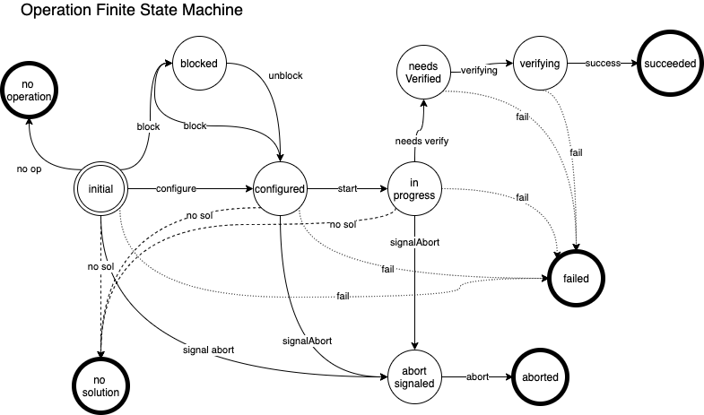

# FAS | Control Logic

### Change log 

|Date	|Author	|Description	|
| --- | --- | --- |
|2020-05-12	|@anieuwsma	|	initial revision|

This document explains the life cycle of an action and an operation.  

## Action
An action, as previously defined, is  collection of operations (individual firmware update tasks).  The life cycle of any action can be divided into the static portion of the life cycle (where the action is created and configured, and the dynamic portion of the life cycle, where the action is executed to completion.

The following FSM describes the life cycle of an action:


### States

* `new` - initial state of the action.  
* `configured` - the action has valid parameters, and has created all necessary operations to fulfill the request of the action.
* `blocked` - the action has been configured, but can not proceed because another action is currently running.
* `running` - the action has been started and is being actively executed.
* `abort signaled` - a user request has come through demanding the abortion of the action.
* `aborted` - abort sequence has completed
* `completed` - the action has been executed.  It does not imply the success of the  operations, but rather the finality of the action.


### Static
The static life cycle begins with a request to create an action, either through: 

1. direct - user request to `/actions` API
2. in-direct - user request to restore a snapshot via `/snapshots` API

The creation logic is slightly different between a regular create and a snapshot restore. 

#### Direct Creation

#####  Params

Example Parameters: 

**NOTE, this command would not be possible, rather I am showing the full range of possible params.**

```
{
  "stateComponentFilter": {
    "xnames": [
      "x0c0s0b0",
      "x0c0s2b0"
    ],
    "partitions": [
      "p1"
    ],
    "groups": [
      "red",
      "blue"
    ],
    "deviceTypes": [
      "nodeBMC"
    ]
  },
  "inventoryHardwareFilter": {
    "manufacturer": "intel",
    "model": "c5000"
  },
  "imageFilter": {
    "imageID": "3fa85f64-5717-4562-b3fc-2c963f66afa6"
  },
  "targetFilter": {
    "targets": [
      "BIOS",
      "BMC"
    ]
  },
  "command": {
    "version": "explicit",
    "tag": "default",
    "overrideDryrun": true,
    "restoreNotPossibleOverride": true,
    "timeLimit": 10000,
    "description": "update cabinet xxxx"
  }
}
```

// validation

// process - createUpdateList logic

#### In-Direct Creation

// params -> infered

* `name` - in path.  Name of snapshot
* `overrideDryrun` - in query. Bool, should the generated action be a live update? defaults to false, will perform dryrun
* `timeLimit` - in query. Time limit in seconds for an operation to attempt.
* `confirm` - in query. Confirm intent to perform restore of snapshot.

//process - restore snapshot logic

###  Dynamic Life Cycle
The dynamic life cycle begins when the action is transitioned from `new` to `configured`.   The action will then be ultimately transitioned to an end state of `aborted` or `completed`. The LINK TO THING control logic explains in painful detail how this work.

## Operation

An operation, as previously defined, is the firmware action task to perform.  It includes all necessary data to complete the operation.

The following FSM describes the life cycle of an operation:


### States

*  `initial` - the initial state of an operation. The operation does not yet have enough information to be executed.
*  `configured	` - the operation has the necessary data: state manager data, image data (what to update to, what to update from).
*  `blocked` - the operation has been configured, but can not proceed because another operation for the same device is currently planned for execution before this operation. 
*  `in progress` - the operation has been configured, and has been started by a process in the control loop.
*  `needs verified` - the operation has completed the update command and needs to be verified that it has set the firmware version to the expected version.
*  `verifying` - the control loop has acknowledged that the operation needs verified and has begun the verification process. This state also implies that a power action may be taken to reboot the device (in order to complete the update process). 
*  `succeeded` - the operation has successfully completed and verified to be at the correct version.
*  `failed` - the operation has failed.  This could happen because of a communication failure, a failure of the device, or some other reason.  It is not clear what firmware version is on the device, but it is reasonable to expect that it is not the expected version. 
*  `abort signaled` - the action has signaled abort, and now the operation needs to abort as well.
*  `aborted` - the operation has been aborted. No further work will be done to complete the operation.  It is unclear what state the firmware is in, it is probable to assume that the firmware update was not performed, although it is possible that the update was perform and that the abort has merely stopped the verification. 
*  `no solution` - there is no viable solution available to update the device.  
*  `no operation` - there is no operation available to perform. This is  because the ToFirmwareVersion is already equal to the FromFirmwareVersion.

## Control Loop

The control loop is an infinite loop (from a separate go routine) that will delay 5 seconds between iterations. 


### DO LAUNCH

`doLaunch` is launched as a go routine.  It has an infinite loop with a sleep of 1 second.  It will check the quit and timeout channels, else default to doing the desired work.


### DO VERIFY

`doVerify` is launched as a go routine.  It has an infinite loop with a sleep of 1 second.  It will check the quit and timeout channels, else default to doing the desired work.


