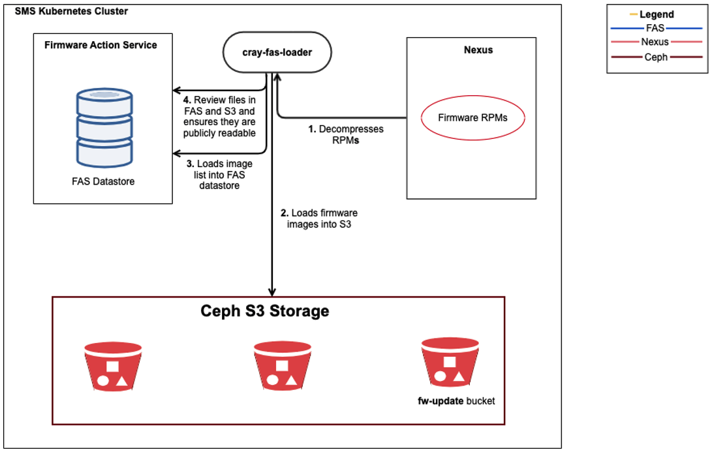
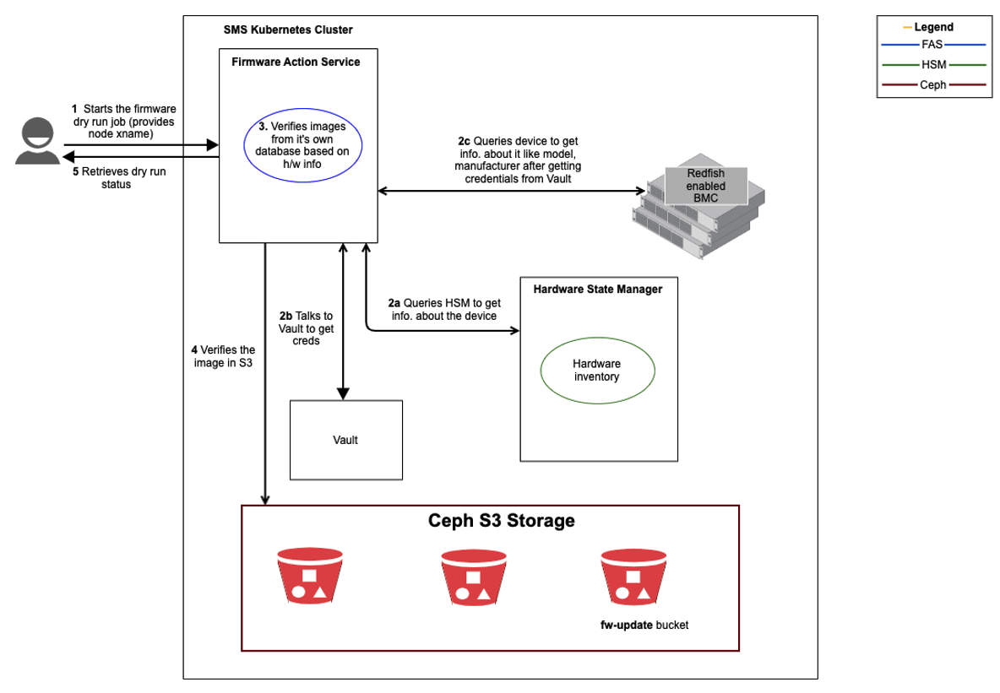
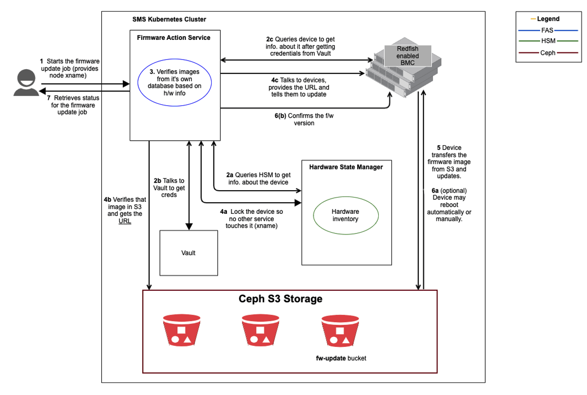
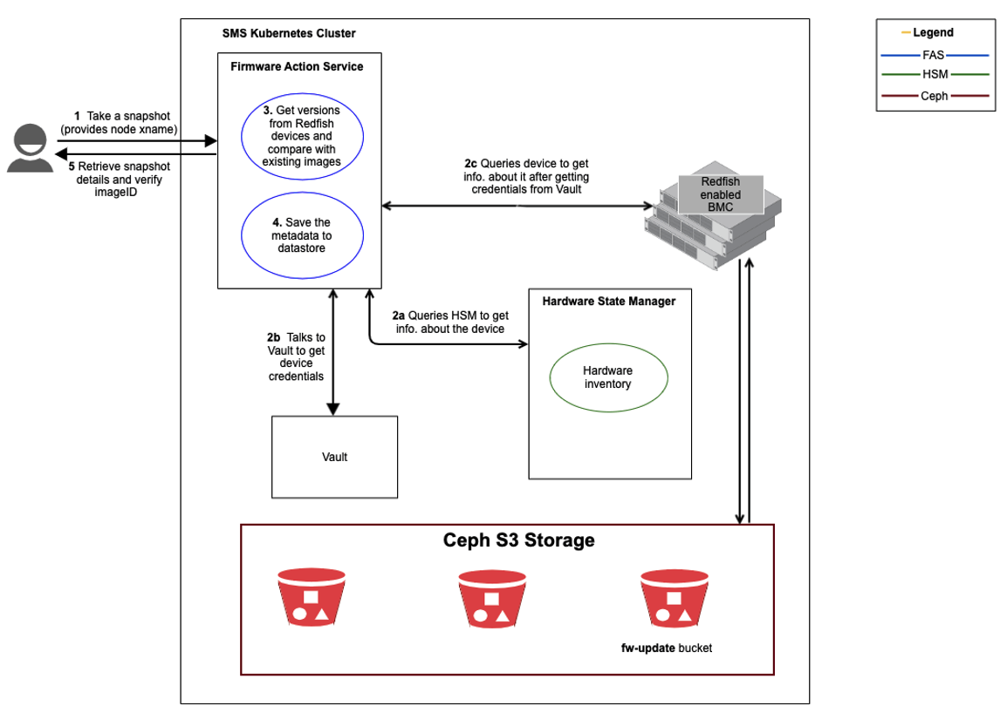

# FAS Workflows

The following workflows present a high-level overview of common Firmware Action Service (FAS) operations. These workflows depict how various services interact with each other when performing FAS operations and help provide a quicker and deeper understanding of how the system functions. This section of documentation is not provided as a how-to document, but rather to give insight into the working of the system.

The following workflows are included in this section:

* [Load Firmware](#load)
* [Perform a Dry-Run](#dryrun)
* [Update Firmware](#update)
* [Create a Snapshot](#snapshot)


## <a name="load">Load Firmware</a> 

**Use Case:** Firmware images should be available in S3 and image data available in FAS. This happens automatically during installation and can be re-run if needed.

**Components:** The Firmware Action Service (FAS) requires image data in order to load firmware into different devices in the system. Firmware images bundles are retrieved by the system via Nexus in order to be used by FAS. This process is managed by the cray-fas-loader Kubernetes job. This workflow occurs automatically during installation and can be re-run if there is a new release or patch. It involves the interaction of the cray-fas- loader with FAS, Nexus, and S3.

Mentioned in this workflow:

* FAS tracks and performs actions (upgrade, downgrade, create and restore snapshot) on system firmware.
* The Simple Storage Service (Ceph S3) is an artifact repository that stores artifacts.
* Nexus stores firmware RPMs to update firmware for system components.



### **Workflow Overview:** 
The firmware RPMs contain binaries and JSON file. The cray-fas-loader extracts the RPM and gets the binaries and JSON imagefile. It uploads the binaries into S3 and loads the data from the imagefile into FAS using the S3 reference.

The following sequence of steps occur during this workflow:

#### 1.  cray-fas-loader decompresses firmware RPMs

​	The `cray-fas-loader` pulls firmware bundled (RPMs) from Nexus.

​	The firmware RPMs are decompressed and produce the binary and image JSON file.

#### 2.  cray-fas-loader uploads images into S3

​	The `cray-fas-loader` uploads binaries to S3.

#### 3.  cray-fas-loader uploads image JSON file to FAS datastore

​	The `cray-fas-loader` uploads the image JSON file to the FAS datastore. The image JSON file is the metadata about the actual image and is used by FAS 	to associate each image with the device it is for.

#### 4.  Review files in FAS and ensure they are publicly readable

​	The `cray-fas-loader` reviews each image reference in FAS and ensures that the actual artifact in S3 is publicly readable. Publicly readable artifacts can be 	downloaded if the user is on the system and has appropriate access.

## <a name="dryrun">Perform a Dry-Run </a> 

**Use Case:** Administrator performs a dry-run on targeted devices to determine the firmware that can be updated. 

**Components:** FAS interacts with the Hardware State Manager (HSM), device data, and image data in order to perform a dry run. A dry-run will create a query according to the filters requested by the admin. It will initiate an update sequence to determine what firmware is available, but will not actually change or update the firmware. Dry-runs are enabled by default, and can be configured with the `overrideDryrun` parameter.

Mentioned in this workflow:

* FAS tracks and performs actions (upgrade, downgrade, create and restore snapshot) on system firmware.
* Hardware State Manager (HSM) monitors and interrogates hardware components in a system, tracking hardware state and inventory information, and making it available via REST queries and message bus events when changes occur.
* The Simple Storage Service (Ceph S3) is an artifact repository that stores artifacts.

  

### **Workflow Overview:** 
The following sequence of steps occur during this workflow.

#### 1.   Administrator starts the dry-run

The administrator performs a dry-run to determine what firmware can be updated for all components on the node identified by xname.

```
cray fas actions create {CUSTOM_DEVICE_PARAMETERS.json}
```

The administrator enters values like xname, version etc. in a JSON payload (sample below). Ensure that the `overrideDryrun` parameter is set to false (default value) so that the dry-run occurs. 

```json
{
	"stateComponentFilter": 
			{ "xnames": 
				[ "x0c0s0b0",
        "x0c0s2b0"] },
  "targetFilter": { 
  		"targets": 
  			[ "BIOS",
  			"BMC" ] },
  "command": { 
  		"version": "latest",
  		"tag":  "default", 
  		"overrideDryrun": false,
  		"restoreNotPossibleOverride": true,
      "timeLimit": 1000, 
      "description": "update 20200623_0" } }
```

Upon success, the string response contains an action ID which can be used to query the status of the dry run.

```json
{
	"actionID": "fcac1eec-e93b-4549-90aa-6a59fda0f4c6",
	"overrideDryrun": false 
} 
```

#### 2.   FAS collects information

#### 	a.   FAS to HSM

​		FAS queries HSM about the xnames.

#### 	b.   FAS to Vault

​		FAS queries Vault for xname credentials. These credentials are needed to communicate with the device.

#### 	c.   FAS to the device

​		FAS queries the device and gets information like model, manufacturer from it.

#### 3.   FAS verifies image record from its database

​		Based on the hardware information it has collected, FAS looks in it's own internal list of image records and verifies if it has images that can satisfy user request.

#### 4.   FAS verifies if the images exist in S3

​		The FAS record has a pointer to S3 and verifies that the images exist in S3.

#### 5.   Administrator retrieves information and status for actionID

​		View the status of the dry-run with the returned actionID from step 1.

```
# cray fas actions describe {actionID}
```


## <a name="update">Update Firmware </a> 

**Use Case:** Administrator updates the firmware for all targets on a specific node to the latest version. 

**Components:**The Firmware Action Service (FAS) provides an interface for managing firmware versions of Redfish-enabled hardware in the system. FAS interacts with the Hardware State Manager (HSM), device data, and image data in order to update firmware.

Mentioned in this workflow:

* FAS tracks and performs actions (upgrade, downgrade, create and restore snapshot) on system firmware.
* Hardware State Manager (HSM) monitors and interrogates hardware components in a HPE Cray EX system, tracking hardware state and inventory information, and making it available via REST queries and message bus events when changes occur.
* The Simple Storage Service (Ceph S3) is an artifact repository that stores artifacts.

  

### Workflow Overview:
Before updating firmware, an administrator must consider firmware dependencies between different components and determine the update sequence. For example, firmware of one component may need to be updated before firmware for another component can be updated.

The following sequence of steps occur during this workflow:

#### 1.   Administrator starts the firmware update job

Upgrade firmware to the latest version for all components on the node identified by xname.

```
# cray fas actions create {CUSTOM_DEVICE_PARAMETERS.json}
```

The administrator enters values like xname, version etc. in a JSON payload (sample below). Ensure that the

`overrideDryrun` parameter is set to true so that the actual update occurs.

```json
{
	"stateComponentFilter": 
			{ "xnames": 
				[ "x0c0s0b0",
        "x0c0s2b0"] },
  "targetFilter": { 
  		"targets": 
  			[ "BIOS",
  			"BMC" ] },
  "command": { 
  		"version": "latest",
  		"tag":  "default", 
  		"overrideDryrun": true,
  		"restoreNotPossibleOverride": true,
      "timeLimit": 1000, 
      "description": "update 20200623_0" } }
```

Upon success, the string response contains an action ID which can be used to query the status of the dry run.

```json
{
	"actionID": "fcac1eec-e93b-4549-90aa-6a59fda0f4c6",
	"overrideDryrun": true 
} 
```

#### 2.   FAS collects information

#### a.      FAS to HSM

​		FAS queries HSM about the xnames.

#### b.     FAS to Vault

​		FAS queries Vault for xname credentials. These credentials are needed to communicate with the device.

#### c.      FAS to the device

​		FAS queries the device and gets information like model, manufacturer from it.

#### 3.   FAS verifies image from its database

​		Based on the hardware information it has collected, FAS looks in it's own internal list of images and verifies if it has images that can satisfy user request. Once it finds the images, it tries to talk to the Redfish devices.

#### 4.   FAS prepares to update the firmware

#### a.      Reserve the device in HSM so no other service touches it

​		Reserve the xname component in HSM so that other services like CAPMC cannot make any changes to the device.

#### b.     Verifies the image in S3 and gets the URL

​		FAS record has a pointer to S3 and gets the image URL.

#### c.      FAS to the device

​		FAS passes the S3 URL to the device.

#### 5.   Device transfers the image from S3 and updates

​		Device transfers the image from S3 and initiates the update firmware process.

#### 6.   FAS finalizes the firmware update

#### a.      Device automatically/manually reboots

​		Device may need to be rebooted.

#### b.     Confirms the firmware version

​		FAS confirms the firmware version of the device.

#### 7.   Retrieve information and status for actionID

​		Administrator uses the action ID from step 1 to check the status and details about the firmware update.

```
# cray fas actions status describe {actionID}
```

## <a name="snapshot">Create a Snapshot </a> 

**Use Case:** Administrator takes a snapshot of targets on selected xnames. A snapshot captures the firmware version for the selected devices.

**Components:** FAS interacts with the Hardware State Manager (HSM), device data, and image data in order to create a snapshot. Each FAS snapshot records the firmware value for each device (type and target) mentioned in the user payload into the FAS database. System Administrators can restore the firmware on a system to a previous snapshot.

Mentioned in this workflow:

* FAS tracks and performs actions (upgrade, downgrade, create and restore snapshots) on system firmware.
* Hardware State Manager (HSM) monitors and interrogates hardware components in a system, tracking hardware state and inventory information, and making it available via REST queries and message bus events when changes occur.
* The Simple Storage Service (Ceph S3) is an artifact repository that stores artifacts.



### Workflow Overview:
The following sequence of steps occur during this workflow:

#### 1.   Administrator creates a snapshot

The administrator creates a snapshot to record the firmware versions for targets on specific devices.

```
# cray fas snapshots create {EXAMPLE_FILE.json}
```

The administrator enters values like xname, targets etc. in a JSON payload (sample below).

```json
	{ "name": "20200402_all_xnames",
  	"expirationTime": "2020-06-26T16:32:53.275Z",
    "stateComponentFilter": {
    	"xnames": [ "x0c0s0b0", "x0c0s2b0" ], 
    	"deviceTypes": [ "nodeBMC" ] }, 
    "inventoryHardwareFilter": { 
    	"manufacturer": "gigabyte" },
    "targetFilter": { 
    	"targets": [ "BIOS", "BMC" ]
		}
}
```

#### 2.   FAS collects information

#### a.      FAS to HSM

​	FAS queries HSM about the xnames.

#### b.     FAS to Vault

​	FAS queries Vault for xname credentials. These credentials are needed to communicate with the device.

#### c.      FAS to the device

​	FAS queries the device and gets information like model, manufacturer from it. In addition, it also gets firmware version that is running on the device.

#### 3.   FAS gets firmware versions from Redfish devices and compares images from its database

​	Based on the hardware information it has collected, FAS looks in it's own internal list of image records and verifies if it has images for the specific firmware versions.

#### 4.   FAS saves the device and firmware version data to its own database

​	Once FAS finds the corresponding image for each device, FAS saves the metadata to its datastore. As part of snapshot creation, only metadata is saved to FAS. An actual image is not saved.

#### 5.   Retrieve details for the snapshot and verify the imageID

​	Retrieve details about the specific snapshot by providing the name. Ensure that the imageID value is a non- zero number.


```
# cray fas snapshots describe {SNAPSHOT_NAME}
```

If imageID is a string of zeros like `00000000-0000-0000-0000-000000000000`, it implies that there is no image associated with this snapshot. Restoring this snapshot does not lead to any results as there is no image to restore.<!---->